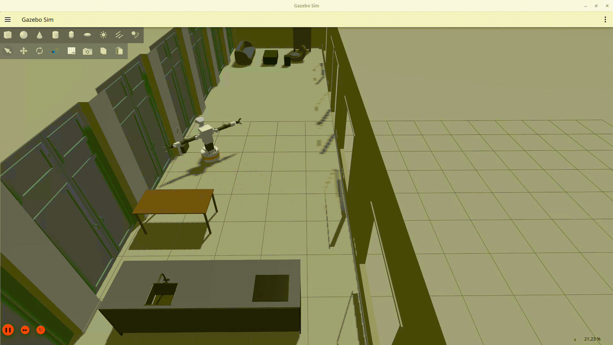
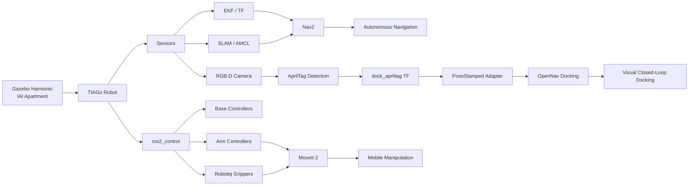

# TIAGo Autonomous Mobile Manipulation

> **A ROS 2 autonomy portfolio project for navigation, perception, docking, and mobile manipulation on a TIAGo dual-arm robot in Gazebo Harmonic.**


---
## 🎥 Visual Docking Demo

<p align="center">
  
</p>

<p align="center">
  <strong>AprilTag-refined autonomous docking using ROS 2 Nav2 + OpenNav Docking.</strong>
</p>

<p align="center">
  <a href="media/forward_docking.webm">▶ Watch the full docking video</a>
</p>

> The robot first navigates to a coarse staging pose, detects the docking station using the head RGB-D camera, refines the target using an AprilTag pose estimate, and performs the final approach with OpenNav's closed-loop docking controller.

---
## Overview

This project develops a full autonomy stack for a **TIAGo dual-arm mobile manipulator** in a custom indoor environment.

The goal is not only to make the robot move from A to B, but to build a complete robotics workflow that combines:

- mobile base control,
- state estimation,
- localization and mapping,
- autonomous navigation,
- RGB-D perception,
- AprilTag-based visual docking,
- dual-arm manipulation,
- gripper integration,
- and high-level task execution.

The project is designed as a practical robotics engineering portfolio demonstrating integration across **ROS 2, Gazebo, Nav2, ros2_control, perception, TF, and manipulation**.

---

## Project Demo Pipeline



---

## Current Status

| Subsystem | Status |
|---|---|
| Custom apartment simulation | ✅ Working |
| TIAGo dual-arm simulation | ✅ Working |
| ros2_control integration | ✅ Working |
| Differential-drive mobile base | ✅ Working |
| LiDAR / IMU / RGB-D camera | ✅ Working |
| TF tree | ✅ Working |
| EKF state estimation | ✅ Working |
| SLAM | ✅ Working |
| AMCL localization | ✅ Working |
| Nav2 global navigation | ✅ Working |
| Static-pose automatic docking | ✅ Working |
| AprilTag detection | ✅ Working |
| Camera optical-frame calibration | ✅ Working |
| AprilTag 6-DoF pose estimation | ✅ Working |
| TF → `PoseStamped` dock adapter | ✅ Working |
| OpenNav external dock perception | ✅ Working |
| Closed-loop visual docking | 🚧 Controller convergence / timeout tuning |
| MoveIt 2 manipulation | ⏭ Next |
| Autonomous pick-and-place missions | ⏭ Planned |
| High-level mission behavior tree | ⏭ Planned |

---

## Robotics Stack

### Core

- **ROS 2 Jazzy**
- **Gazebo Harmonic**
- **Python / C++**
- **TF2**
- **ros2_control**
- **RViz 2**

### Navigation

- Nav2
- AMCL
- SLAM
- EKF state estimation
- 2D LiDAR
- wheel odometry
- IMU
- local/global costmaps
- path planning and local trajectory control

### Perception

- RGB-D head camera
- calibrated camera intrinsics
- ROS optical camera frames
- AprilTag `tag36h11`
- pose estimation using PnP
- TF-based pose transformation

### Docking

- OpenNav Docking
- nominal map-based dock pose
- staging-pose navigation
- AprilTag-based dock refinement
- continuous external pose updates
- closed-loop final approach

### Manipulation

- TIAGo dual arms
- Robotiq grippers
- ros2_control joint trajectory controllers
- MoveIt 2 integration planned

---

## Simulation Environment

The project uses a custom indoor apartment / research-lab environment designed for testing realistic autonomous mobile manipulation tasks.

The environment includes:

- rooms and corridors,
- furniture and obstacles,
- navigation-relevant geometry,
- a dedicated docking station,
- an AprilTag visual target,
- manipulation areas.

The map is used by both SLAM/AMCL and Nav2 for autonomous navigation.

---

## Robot

The simulated platform is a **TIAGo dual-arm mobile manipulator**.

Major interfaces include:

```text
Mobile Base
├── Differential drive
├── Wheel odometry
├── 2D LiDAR
└── IMU

Upper Body
├── Torso
├── Pan / tilt head
├── RGB-D camera
├── Left arm
├── Right arm
├── Left Robotiq gripper
└── Right Robotiq gripper
```

---

## Navigation Architecture

```text
/scan ───────────────┐
                     │
/base_imu ───────┐   │
                 ▼   ▼
Wheel Odom ──> EKF / TF
                 │
                 ▼
               odom
                 │
                 ▼
            AMCL / map
                 │
                 ▼
               Nav2
        ┌────────┴────────┐
        ▼                 ▼
 Global Planner     Local Controller
        │                 │
        └────────┬────────┘
                 ▼
              /cmd_vel
                 │
                 ▼
        ros2_control / Gazebo
```

---

## AprilTag-Based Visual Docking

The docking system combines a coarse global dock pose with visual refinement.

### 1. Nominal Dock Pose

A dock is registered in the Nav2/OpenNav dock database:

```yaml
dock_tiago:
  type: simple_charging_dock
  frame: map
  pose: [8.17, 4.70, 1.5708]
  id: "dock_tiago"
```

This pose is used for coarse navigation toward the docking area.

### 2. AprilTag Detection

The docking station contains a `tag36h11` AprilTag.

```text
/head_front_camera/image
/head_front_camera/camera_info
              │
              ▼
        apriltag_ros
              │
              ▼
       dock_apriltag TF
```

The camera messages use the ROS optical convention:

```text
head_front_camera_color_optical_frame
```

### 3. External Dock Pose

A small adapter converts the detected tag TF into:

```text
/detected_dock_pose
geometry_msgs/msg/PoseStamped
```

The pose is transformed into `odom`, which is also used as the OpenNav docking fixed frame.

### 4. Visual Refinement

OpenNav consumes the external pose:

```text
dock_apriltag
      │
      ▼
/detected_dock_pose
      │
      ▼
SimpleChargingDock
      │
      ├── filtering
      ├── AprilTag orientation correction
      ├── tag-to-dock translation
      └── planar projection
      │
      ▼
/dock_pose
      │
      ▼
Closed-loop docking controller
```

The current pipeline successfully reaches OpenNav's **CONTROLLING** state and generates velocity commands from the visually refined dock pose.

The remaining work is final convergence and timeout tuning.

---

## AprilTag Calibration

The raw visual tag is mounted on a `0.18 m × 0.18 m` textured surface.

Because the AprilTag pose estimator expects the effective detection-border size rather than necessarily the full texture dimensions, the tag size was calibrated experimentally using TF ground truth.

The current effective detector size is approximately:

```yaml
size: 0.1526
```

Calibration compares:

```text
camera → dock_apriltag_gt
```

against:

```text
camera → dock_apriltag
```

and uses the scale relationship:

\[
s_\mathrm{new}
=
s_\mathrm{old}
\frac{d_\mathrm{true}}
     {d_\mathrm{estimated}}
\]

---

## Docking Configuration

Current visual docking configuration:

```yaml
docking_server:
  ros__parameters:
    base_frame: base_footprint
    fixed_frame: odom

    dock_approach_timeout: 60.0

    docks:
      - dock_tiago

    dock_tiago:
      type: simple_charging_dock
      frame: map
      pose: [8.17, 4.70, 1.5708]
      id: "dock_tiago"

    dock_plugins:
      - simple_charging_dock

    simple_charging_dock:
      plugin: opennav_docking::SimpleChargingDock

      docking_threshold: 0.10
      staging_x_offset: -0.70

      use_external_detection_pose: true
      external_detection_timeout: 2.0

      external_detection_translation_x: -0.23
      external_detection_translation_y: 0.0

      external_detection_rotation_roll: -1.5708
      external_detection_rotation_pitch: 1.5708
      external_detection_rotation_yaw: 0.0

      filter_coef: 0.1

      use_battery_status: false
      use_stall_detection: false
```

---

## Repository Structure

```text
└── tiago_autonomy
    ├── LICENSE
    ├── README.md
    ├── tiago_autonomy_bringup
    │   ├── CMakeLists.txt
    │   ├── config
    │   │   └── tiago_controllers.yaml
    │   ├── launch
    │   │   ├── tiago_autonomy_bringup.launch.py
    │   │   └── visualize_tiago.launch.py
    │   ├── LICENSE
    │   ├── package.xml
    │   ├── rviz2
    │   │   └── rviz_config.rviz
    │   ├── scripts
    │   └── urdf
    │       ├── apartment_gazebo.sdf
    │       ├── apartment.urdf
    │       ├── tiago_autonomy.urdf
    │       └── urdf_to_map.py
    └── tiago_navigation
        ├── CMakeLists.txt
        ├── config
        │   ├── apriltag_dock.yaml
        │   ├── ekf.yaml
        │   └── nav2_tiago_params.yaml
        ├── launch
        │   └── tiago_navigation.launch.py
        ├── maps
        │   ├── apartment_map.pgm
        │   └── apartment_map.yaml
        ├── package.xml
        └── scripts
            └── dock_pose_publisher.py

```

> The exact package structure may evolve as perception, manipulation, and mission-planning modules are added.

---

## Build

```bash
cd ~/portfolio

colcon build --symlink-install

source install/setup.bash
```

---

## Run the Simulation

```bash
ros2 launch tiago_autonomy_bringup \
  tiago_autonomy_bringup.launch.py
```

Then start the navigation stack using the launch file in:

```text
tiago_navigation/launch/
```

---

## Useful Debug Commands

### Navigation

```bash
ros2 run tf2_ros tf2_echo map base_footprint

ros2 topic echo /cmd_vel
```

### Camera

```bash
ros2 topic echo \
  /head_front_camera/camera_info \
  --once
```

### AprilTag

```bash
ros2 topic echo /detections --once

ros2 run tf2_ros tf2_echo \
  head_front_camera_color_optical_frame \
  dock_apriltag
```

### Visual Docking

```bash
ros2 topic echo /detected_dock_pose --once

ros2 topic echo /dock_pose --once

ros2 topic info /detected_dock_pose -v
```

---

## Engineering Challenges Solved

This project involved debugging several integration problems that are common in real robotic systems:

- incorrect / missing TF transforms,
- Gazebo ↔ ROS frame conventions,
- camera body-frame vs optical-frame mismatch,
- AprilTag PnP pose inconsistencies,
- tag-size calibration,
- ROS-Gazebo topic bridging,
- differential-drive controller integration,
- localization / odometry synchronization,
- Nav2 trajectory feasibility,
- docking staging-pose geometry,
- visual dock-frame conversion,
- external perception integration with OpenNav,
- controller command verification.

The project therefore focuses not only on algorithms, but on **system-level robotics integration and debugging**.

---

## Next Milestones

### 1. Finish Visual Docking

Current target:

```text
AprilTag detection
      ↓
external dock pose
      ↓
OpenNav CONTROLLING
      ↓
precise convergence
      ↓
DOCKED
```

Remaining tasks:

- verify commanded vs measured base velocity,
- tune final approach timeout,
- validate front/backward docking convention,
- reduce final approach velocity if required,
- test repeatability from multiple starting poses.

### 2. MoveIt 2

Integrate motion planning for both TIAGo arms:

```text
Perception
   ↓
Target Pose
   ↓
MoveIt 2
   ↓
Collision-aware trajectory
   ↓
ros2_control
   ↓
TIAGo arm
```

### 3. Pick and Place

Implement:

- object approach,
- grasp pose generation,
- arm motion,
- Robotiq gripper control,
- object transport,
- placement.

### 4. Full Autonomous Mission

Final target:

```text
Navigate
   ↓
Perceive
   ↓
Manipulate
   ↓
Transport
   ↓
Place
   ↓
Return
   ↓
Automatically Dock
```

---

## Why This Project

Modern robotics engineering requires more than implementing isolated algorithms.

A real autonomous robot must integrate:

- perception,
- estimation,
- planning,
- control,
- communication,
- hardware interfaces,
- coordinate transforms,
- and task logic.

This project is an attempt to build that complete chain on a realistic mobile-manipulation platform.

---

## Author

**Mitesh Savsaviya**

Robotics / Autonomous Systems / Control

GitHub: `mitsav01`

---

## Project Goal

> Build a robot that can **understand its environment, navigate autonomously, manipulate objects, and return to its dock without manual intervention.**
